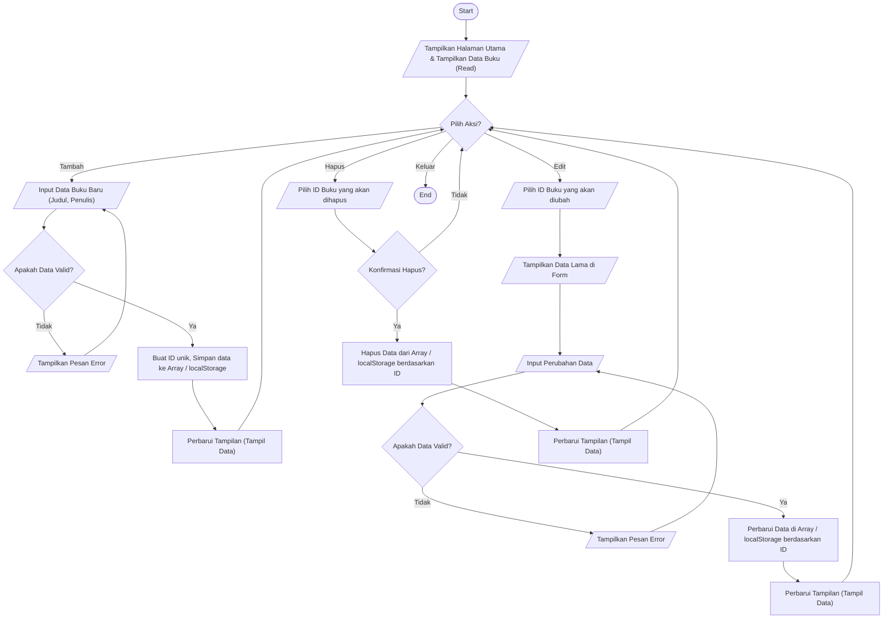

# Dokumentasi Proyek Ujian Tengah Semester (UTS)
**Nama StartUp:** ReadBridge
**Deskripsi:** ReadBridge adalah platform ekosistem literasi digital (StartUp web berbasis Front-End) yang menghubungkan pembaca, penulis, perpustakaan mitra, dan komunitas. Platform ini interaktif, dibangun menggunakan HTML, CSS (Tailwind), dan JavaScript, serta mampu mengelola data secara dinamis di sisi klien (browser) menggunakan manipulasi DOM dan `localStorage`.

---

## A. Penjelasan Singkat Alur Program (CRUD Data Buku)

Dalam mendemonstrasikan kemampuan aplikasi dalam mengelola data secara dinamis di sisi *client* (browser), dokumentasi ini mengambil contoh **Modul Pengelolaan Data Buku (Koleksi / Marketplace)**. Modul ini memiliki 4 alur utama:

1. **Menampilkan Data (Read):** Saat halaman dimuat, program membaca data dari penyimpanan lokal (array JavaScript / `localStorage`). Jika data kosong, program menampilkan pesan kosong. Jika ada, data diproses melalui perulangan (looping) untuk menghasilkan elemen HTML secara dinamis dan ditampilkan ke layar pengguna.
2. **Menambah Data (Create):** Pengguna memasukkan data (Judul, Penulis, Harga) melalui form. Program menangkap input tersebut, melakukan validasi (memastikan tidak ada kolom kosong), membuat objek data baru dengan ID unik, lalu menambahkannya ke dalam array penyimpanan dan memperbarui tampilan layar.
3. **Mengubah Data (Update):** Pengguna menekan tombol "Edit" pada salah satu item buku. Program mencari data tersebut berdasarkan ID, lalu menampilkan nilainya ke dalam form edit. Setelah pengguna selesai mengubah data dan menyimpan, program memperbarui nilai pada array di memori dan menyegarkan tampilan.
4. **Menghapus Data (Delete):** Pengguna menekan tombol "Hapus". Program menampilkan dialog konfirmasi. Jika disetujui, program mencari letak data tersebut di dalam array berdasarkan ID, menghapusnya dari memori (`localStorage`), dan menyegarkan tampilan.

---

## B. Flowchart CRUD (Create, Read, Update, Delete)

*(Catatan: Flowchart di bawah direpresentasikan menggunakan standar diagram Mermaid. Anda dapat melihatnya melalui Markdown Viewer atau ekstensi Mermaid di IDE).*



---

## C. Pseudocode

Berikut adalah Pseudocode yang merepresentasikan logika alur kerja aplikasi di sisi *client* (JavaScript).

```text
// INISIALISASI
SET data_buku = BACA_DARI_LOCAL_STORAGE("buku") JIKA KOSONG MAKA []

// FUNGSI MENAMPILKAN DATA (READ)
FUNCTION TampilkanData()
    BERSIHKAN tampilan_tabel
    IF panjang data_buku == 0 THEN
        TAMPILKAN "Belum ada data buku"
    ELSE
        FOR EACH buku IN data_buku
            BUAT elemen_baris_HTML dengan data buku.judul, buku.penulis
            TAMBAHKAN tombol_edit dengan ID buku
            TAMBAHKAN tombol_hapus dengan ID buku
            MASUKKAN elemen_baris_HTML ke tampilan_tabel
        END FOR
    END IF
END FUNCTION

// FUNGSI MENAMBAH DATA (CREATE)
FUNCTION TambahData(input_judul, input_penulis)
    IF input_judul == KOSONG ATAU input_penulis == KOSONG THEN
        TAMPILKAN "Error: Data tidak boleh kosong"
        RETURN
    END IF

    SET id_baru = HASILKAN_ID_UNIK()
    SET buku_baru = { id: id_baru, judul: input_judul, penulis: input_penulis }
    
    TAMBAHKAN buku_baru KEDALAM data_buku
    SIMPAN_KE_LOCAL_STORAGE("buku", data_buku)
    
    PANGGIL TampilkanData()
    TAMPILKAN "Buku berhasil ditambahkan"
END FUNCTION

// FUNGSI MENGUBAH DATA (UPDATE)
FUNCTION UbahData(id_target, input_judul_baru, input_penulis_baru)
    IF input_judul_baru == KOSONG ATAU input_penulis_baru == KOSONG THEN
        TAMPILKAN "Error: Data tidak boleh kosong"
        RETURN
    END IF

    FOR EACH buku IN data_buku
        IF buku.id == id_target THEN
            buku.judul = input_judul_baru
            buku.penulis = input_penulis_baru
            BREAK // Keluar dari loop
        END IF
    END FOR
    
    SIMPAN_KE_LOCAL_STORAGE("buku", data_buku)
    PANGGIL TampilkanData()
    TAMPILKAN "Data buku berhasil diubah"
END FUNCTION

// FUNGSI MENGHAPUS DATA (DELETE)
FUNCTION HapusData(id_target)
    SET konfirmasi = TANYA_PENGGUNA("Apakah Anda yakin ingin menghapus buku ini?")
    
    IF konfirmasi == BENAR THEN
        CARI letak indeks buku DENGAN id == id_target DALAM data_buku
        HAPUS elemen dari data_buku PADA indeks tersebut
        
        SIMPAN_KE_LOCAL_STORAGE("buku", data_buku)
        PANGGIL TampilkanData()
        TAMPILKAN "Buku berhasil dihapus"
    END IF
END FUNCTION

// JALANKAN SAAT HALAMAN DIMUAT
PANGGIL TampilkanData()
```

---
**Keterangan Simbol Flowchart yang Digunakan:**
*   **Terminal (Oval):** Digunakan untuk menandai awal (Start) dan akhir (End) dari program.
*   **Input/Output (Jajargenjang):** Menunjukkan interaksi dengan antarmuka (User Interface), seperti mengisi form input, menampilkan tabel data, atau memunculkan pesan error di layar.
*   **Proses (Persegi Panjang):** Menggambarkan proses internal di memori/JavaScript, seperti menyimpan data ke `localStorage`, mencari ID di dalam Array, atau membuat ID unik.
*   **Decision (Belah Ketupat):** Digunakan untuk pengecekan kondisi logika bersyarat (*If-Else*), misalnya memvalidasi apakah input kosong, atau konfirmasi penghapusan data.
