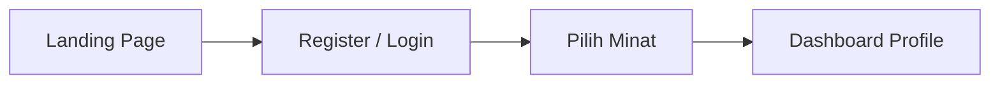
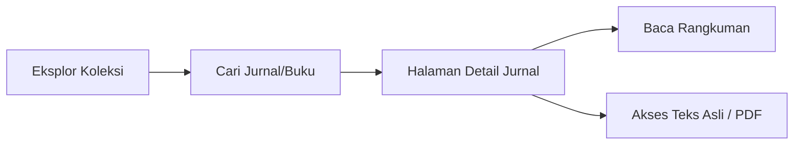
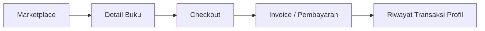
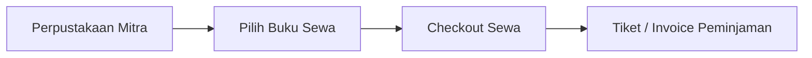
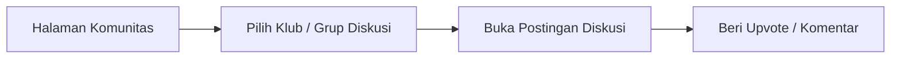
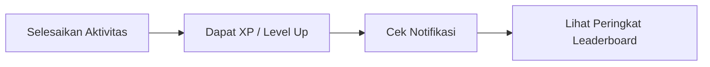

# User Flow Project: ReadBridge

Dokumen ini merangkum alur perjalanan pengguna (*User Journey/User Flow*) dari awal mengakses aplikasi hingga menyelesaikan aktivitas utama (membaca, membeli, menyewa, dan berinteraksi).

---

## 1. Alur Registrasi & Onboarding (Pengguna Baru)
Alur ketika pengguna pertama kali menggunakan platform, membuat akun, dan mempersonalisasi minat bacanya.

**Flow Teks:**
Landing Page (`index.html`) → Buat Akun (`register.html`) → Pilih Minat Buku/Jurnal (`minat.html`) → Masuk ke Profil/Dashboard (`profile.html`)

**Diagram:**

---

## 2. Alur Eksplorasi Literatur & Jurnal Edukasi
Alur bagi pelajar/mahasiswa yang mencari sumber referensi jurnal atau buku ilmiah.

**Flow Teks:**
Halaman Eksplor (`eksplor.html`) → Cari Kata Kunci / Filter Kategori → Buka Detail Jurnal (`detail-jurnal.html`) → Lihat Rangkuman Singkat (`Rangkuman_Lit_Indo_SNBT.html`) → Akses Sumber Asli (*External Link/PDF*)

**Diagram:**

---

## 3. Alur Marketplace (Pembelian Buku Fisik/Digital)
Alur transaksi jual-beli buku layaknya *E-Commerce*.

**Flow Teks:**
Buka Marketplace (`marketplace.html`) → Pilih Buku (`detail.html`) → Klik Beli/Tambah Keranjang → Halaman Checkout (`checkout.html`) → Lakukan Pembayaran → Muncul Invoice (`invoice.html`) → Cek Status di Riwayat Transaksi (`transaksi.html` / tab Detail Akun)

**Diagram:**

---

## 4. Alur Perpustakaan & Sewa Buku (BridgePass)
Alur meminjam buku fisik dari perpustakaan daerah yang bermitra dengan platform.

**Flow Teks:**
Perpustakaan & Sewa (`sewa.html` / `perpustakaan.html`) → Pilih Buku Rental → Checkout Sewa/Peminjaman (`checkout-sewa.html`) → Dapatkan Tiket Ambil Buku / Invoice (`invoice.html`)

**Diagram:**

---

## 5. Alur Interaksi Forum Komunitas
Alur bergabung ke klub buku dan melakukan diskusi atau bedah buku bersama pembaca lain.

**Flow Teks:**
Halaman Komunitas (`komunitas.html`) → Cari atau Gabung Klub Buku (`club-pecinta-fiksi.html` / `club.html`) → Pilih Judul Diskusi (`detail-diskusi.html`) → *Upvote*/Tinggalkan Komentar

**Diagram:**

---

## 6. Alur Gamifikasi (Daily Quests & Leaderboard)
Alur pemberian *reward* (XP) kepada pengguna untuk menjaga tingkat *retention* (pengguna kembali lagi tiap hari).

**Flow Teks:**
Pengguna Berinteraksi (Membaca/Beli/Diskusi) → XP Bertambah & Level Naik → Menerima Notifikasi (`notifikasi.html`) → Cek Peringkat Klasemen Mingguan di Tab Leaderboard (`profile.html#leaderboard`)

**Diagram:**

