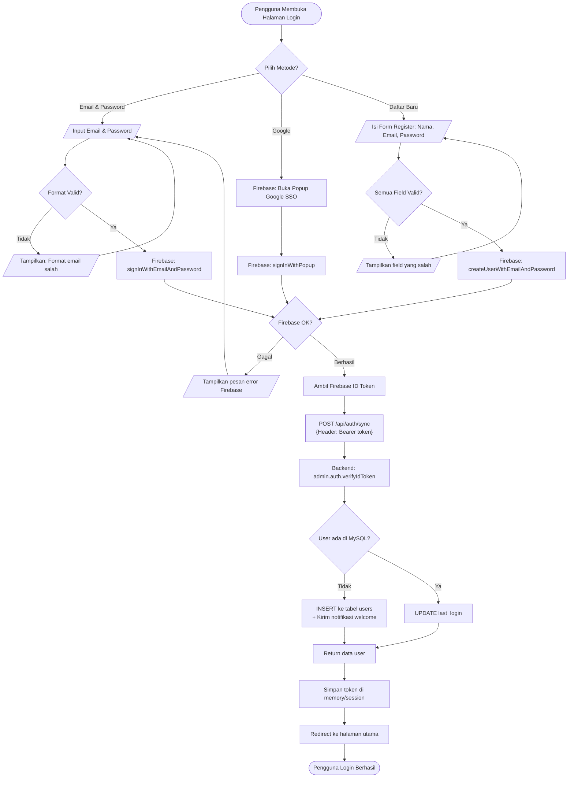
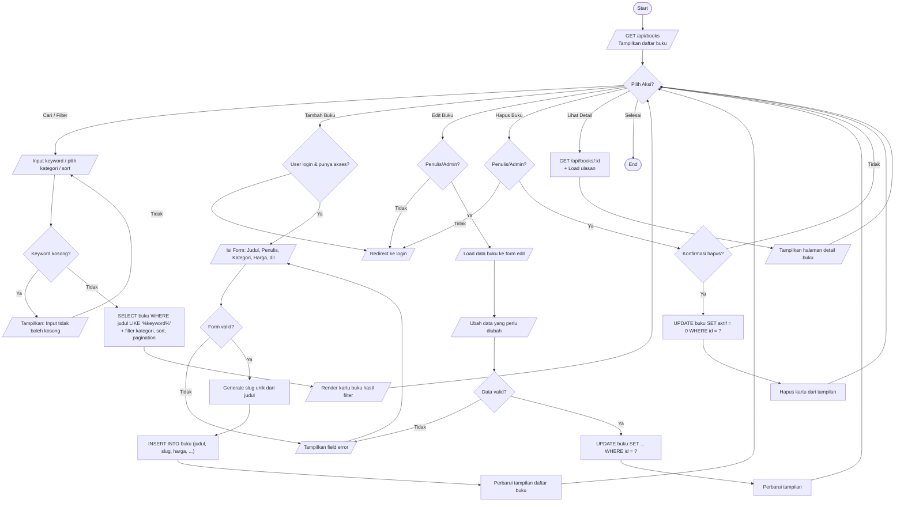
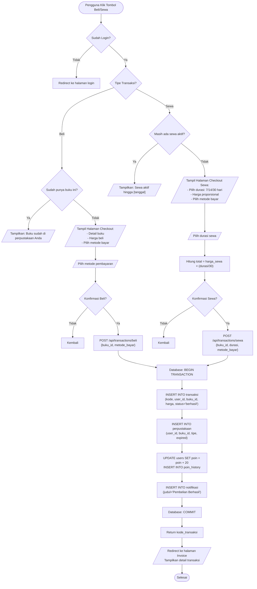
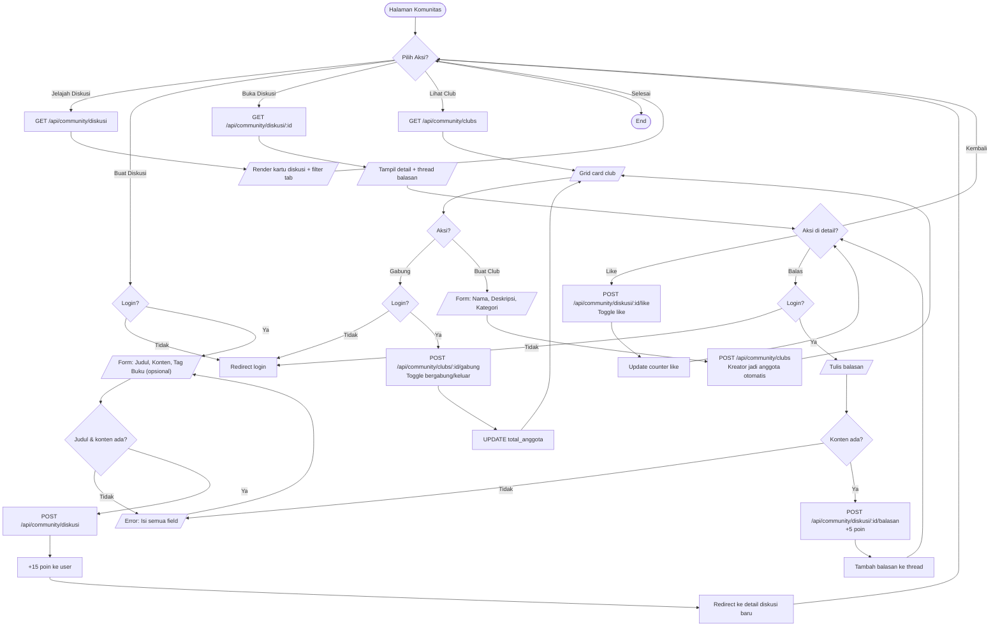
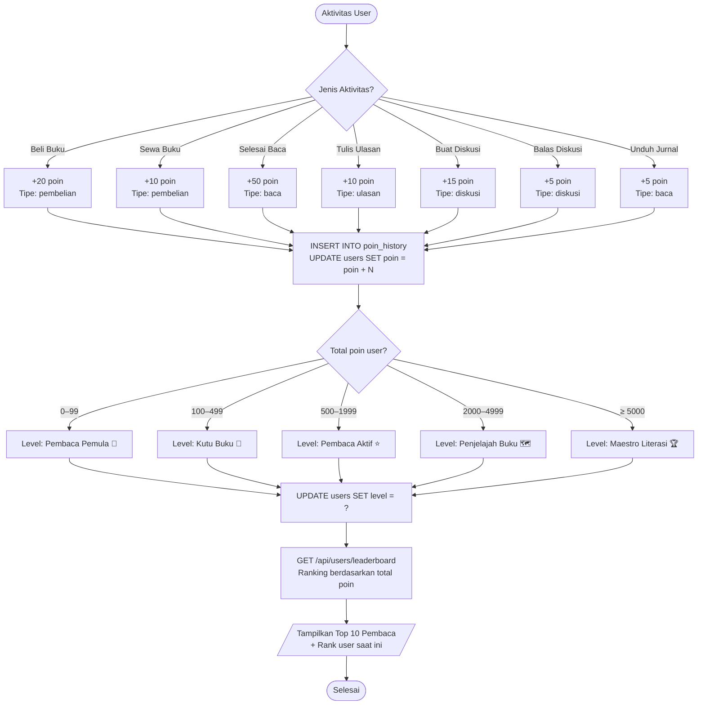

# 📚 Dokumentasi Proyek ReadBridge
**Nama StartUp:** ReadBridge  
**Tipe:** Platform Ekosistem Literasi Digital  
**Stack:** Frontend (HTML + Tailwind CSS + Vanilla JS) + Backend (Node.js + Express + MySQL + Firebase Auth)

---

## A. Arsitektur Sistem

```
┌─────────────────────────────────────────────────────┐
│                   FRONTEND (Browser)                │
│  HTML + Tailwind CSS + Vanilla JavaScript           │
│  ┌──────────┐ ┌──────────┐ ┌──────────┐            │
│  │  Auth    │ │  Books   │ │Community │  ...        │
│  │ (Firebase│ │Marketplace│ │ Diskusi  │            │
│  │  SDK)    │ │  Sewa    │ │  Club    │            │
│  └────┬─────┘ └────┬─────┘ └────┬─────┘            │
└───────┼────────────┼────────────┼────────────────── ┘
        │ Firebase   │ REST API   │ REST API
        ▼ Auth       ▼ Calls     ▼ Calls
┌───────────────┐  ┌─────────────────────────────────┐
│  Firebase     │  │     BACKEND (Node.js + Express) │
│  Auth Server  │  │                                 │
│               │  │  /api/auth      → Auth Routes   │
│  - Google SSO │  │  /api/books     → Books Routes  │
│  - Email/Pass │  │  /api/journals  → Journal Routes│
│  - ID Token   │  │  /api/community → Community     │
│               │  │  /api/users     → User/Profile  │
└───────┬───────┘  │  /api/transactions → Transaksi  │
        │          └──────────────────┬──────────────┘
        │ Verify Token                │ Query
        └─────────────────────────────┘
                                      │
                                      ▼
                        ┌─────────────────────────┐
                        │    MySQL Database        │
                        │  - users                │
                        │  - buku                 │
                        │  - jurnal               │
                        │  - perpustakaan         │
                        │  - transaksi            │
                        │  - diskusi              │
                        │  - club                 │
                        │  - notifikasi           │
                        │  - poin_history         │
                        │  - wishlist             │
                        └─────────────────────────┘
```

---

## B. Flowchart Sistem Lengkap

### B.1 Alur Autentikasi (Login / Register)



---

### B.2 Alur CRUD Buku (Create, Read, Update, Delete)



---

### B.3 Alur Transaksi (Beli & Sewa Buku)



---

### B.4 Alur Komunitas & Diskusi



---

### B.5 Alur Leaderboard & Sistem Poin



---

## C. Pseudocode Backend Lengkap

### C.1 Middleware Autentikasi

```text
FUNCTION verifyToken(request, response, next)
    // SEQUENCE: Ekstrak token dari header
    authHeader = GET request.headers.authorization
    
    // DECISION: Cek keberadaan token
    IF authHeader KOSONG ATAU tidak diawali "Bearer " THEN
        RETURN response 401: "Token tidak ditemukan"
    END IF
    
    idToken = AMBIL bagian setelah "Bearer "
    
    // PROSES: Verifikasi ke Firebase
    TRY
        decoded = AWAIT admin.auth().verifyIdToken(idToken)
        
        // PROSES: Query user dari MySQL
        user = SELECT * FROM users WHERE firebase_uid = decoded.uid AND aktif = 1
        
        // DECISION: User ditemukan?
        IF user KOSONG THEN
            RETURN response 401: "User tidak ditemukan"
        END IF
        
        request.user = user  // Inject ke request
        PANGGIL next()       // Lanjutkan ke handler berikutnya
        
    CATCH error
        IF error.code == "auth/id-token-expired" THEN
            RETURN response 401: "Token expired"
        END IF
        RETURN response 401: "Token tidak valid"
    END TRY
END FUNCTION
```

---

### C.2 Pseudocode CRUD Buku (Backend)

```text
// FUNGSI READ - Ambil daftar buku
FUNCTION GET_BUKU(query_params)
    // SEQUENCE: Bangun query dinamis
    SET where = ["aktif = 1"]
    SET params = []
    
    IF query.search ADA THEN
        TAMBAHKAN "judul LIKE ?" ke where
        TAMBAHKAN "%keyword%" ke params
    END IF
    
    IF query.kategori ADA THEN
        TAMBAHKAN "kategori_slug = ?" ke where
        TAMBAHKAN query.kategori ke params
    END IF
    
    // PROSES: Tentukan urutan
    orderBy = PILIH berdasarkan query.sort:
        "terbaru"  → "created_at DESC"
        "rating"   → "rating DESC"
        "termurah" → "harga_beli ASC"
    
    // PROSES: Eksekusi query dengan pagination
    offset = (page - 1) * limit
    buku = SELECT ... FROM buku WHERE [where] ORDER BY [orderBy] LIMIT limit OFFSET offset
    total = SELECT COUNT(*) FROM buku WHERE [where]
    
    RETURN { success: true, data: buku, pagination: { total, page, totalPages } }
END FUNCTION

// FUNGSI CREATE - Tambah buku baru
FUNCTION POST_BUKU(request)
    // DECISION: Autentikasi
    IF request.user TIDAK ADA THEN
        RETURN 401: "Wajib login"
    END IF
    
    judul = request.body.judul
    penulis = request.body.penulis_nama
    
    // VALIDASI
    IF judul KOSONG ATAU penulis KOSONG THEN
        RETURN 400: "Judul dan penulis wajib diisi"
    END IF
    
    // PROSES: Generate slug unik
    slug = judul.toLowerCase → ganti spasi/simbol dengan "-" → tambah timestamp
    
    // PROSES: Simpan ke database
    result = INSERT INTO buku (judul, slug, penulis_nama, kategori_id, harga_beli, ...)
    
    RETURN 201: { success: true, data: { id: result.insertId, slug } }
END FUNCTION

// FUNGSI UPDATE - Edit buku
FUNCTION PUT_BUKU(id, request)
    // DECISION: Cek buku ada
    existing = SELECT * FROM buku WHERE id = ?
    IF existing KOSONG THEN
        RETURN 404: "Buku tidak ditemukan"
    END IF
    
    // DECISION: Cek kepemilikan
    IF existing.penulis_id != request.user.id DAN request.user.role != "admin" THEN
        RETURN 403: "Akses ditolak"
    END IF
    
    // PROSES: Bangun UPDATE query dinamis
    updates = []
    FOR EACH field IN [judul, harga_beli, deskripsi, ...]:
        IF request.body[field] ADA THEN
            TAMBAHKAN "field = ?" ke updates
        END IF
    END FOR
    
    EXECUTE: UPDATE buku SET [updates] WHERE id = ?
    RETURN { success: true, message: "Buku berhasil diperbarui" }
END FUNCTION

// FUNGSI DELETE - Hapus buku (soft delete)
FUNCTION DELETE_BUKU(id, request)
    existing = SELECT penulis_id FROM buku WHERE id = ?
    IF existing KOSONG THEN RETURN 404 END IF
    IF existing.penulis_id != request.user.id DAN bukan admin THEN RETURN 403 END IF
    
    // PROSES: Soft delete (tidak benar-benar hapus)
    UPDATE buku SET aktif = 0 WHERE id = ?
    RETURN { success: true, message: "Buku berhasil dihapus" }
END FUNCTION
```

---

### C.3 Pseudocode Transaksi (Beli & Sewa)

```text
FUNCTION BELI_BUKU(request)
    buku_id = request.body.buku_id
    
    // VALIDASI INPUT
    IF buku_id KOSONG THEN RETURN 400: "buku_id wajib" END IF
    
    // QUERY: Cek buku tersedia
    buku = SELECT * FROM buku WHERE id = buku_id AND aktif = 1
    IF buku KOSONG THEN RETURN 404: "Buku tidak ditemukan" END IF
    IF buku.bisa_beli == 0 THEN RETURN 400: "Tidak tersedia untuk dibeli" END IF
    
    // DECISION: Sudah punya?
    sudahPunya = SELECT * FROM perpustakaan WHERE user_id = user.id AND buku_id = buku_id AND tipe = 'beli'
    IF sudahPunya ADA THEN RETURN 400: "Sudah memiliki buku ini" END IF
    
    // PROSES: Jalankan transaksi database (atomic)
    BEGIN TRANSACTION
    TRY
        kode = GENERATE kode transaksi (format: RB-YYYYMMDD-XXXXX)
        
        INSERT INTO transaksi (kode, user_id, buku_id, tipe, harga, status='berhasil', dibayar_at=NOW())
        INSERT INTO perpustakaan (user_id, buku_id, tipe='beli', status='aktif')
        UPDATE buku SET total_terjual = total_terjual + 1
        
        // Sistem poin
        INSERT INTO poin_history (user_id, poin=20, tipe='pembelian')
        UPDATE users SET poin = poin + 20
        
        // Notifikasi otomatis
        INSERT INTO notifikasi (user_id, judul='Pembelian Berhasil!', link_url='/invoice.html?kode=...')
        
        COMMIT
        RETURN 201: { kode_transaksi, judul, harga }
    CATCH error
        ROLLBACK
        RETURN 500: "Gagal memproses pembelian"
    END TRY
END FUNCTION

FUNCTION SEWA_BUKU(request)
    buku_id = request.body.buku_id
    durasi  = request.body.durasi  // dalam hari: 7, 14, atau 30
    
    // DECISION: Cek sewa aktif
    sewaAktif = SELECT * FROM perpustakaan WHERE user_id = user.id AND buku_id = buku_id 
                AND tipe = 'sewa' AND status = 'aktif'
    IF sewaAktif ADA THEN
        RETURN 400: "Masih ada sewa aktif hingga [tanggal_expired]"
    END IF
    
    // PROSES: Hitung harga proporsional
    hargaTotal = CEIL(buku.harga_sewa × (durasi / 30))
    tanggalExpired = SEKARANG + durasi hari
    
    BEGIN TRANSACTION
    TRY
        INSERT INTO transaksi (kode, tipe='sewa', durasi_sewa_hari=durasi, harga=hargaTotal)
        INSERT INTO perpustakaan (tipe='sewa', status='aktif', tanggal_expired=tanggalExpired)
        UPDATE buku SET total_disewa = total_disewa + 1
        INSERT INTO notifikasi (judul='Sewa Berhasil!', pesan='Aktif hingga [expired]')
        COMMIT
        RETURN 201: { kode, expired, durasi, harga: hargaTotal }
    CATCH
        ROLLBACK
        RETURN 500: "Gagal memproses sewa"
    END TRY
END FUNCTION
```

---

### C.4 Pseudocode Sistem Poin & Leaderboard

```text
// Dipanggil setiap ada aktivitas user
FUNCTION TAMBAH_POIN(user_id, jumlah_poin, keterangan, tipe)
    INSERT INTO poin_history (user_id, poin=jumlah_poin, keterangan, tipe)
    UPDATE users SET poin = poin + jumlah_poin WHERE id = user_id
    
    // Update level otomatis
    total_poin = SELECT poin FROM users WHERE id = user_id
    level = TENTUKAN_LEVEL(total_poin)
    UPDATE users SET level = level WHERE id = user_id
END FUNCTION

FUNCTION TENTUKAN_LEVEL(poin)
    IF poin >= 5000 THEN RETURN "Maestro Literasi"
    ELSE IF poin >= 2000 THEN RETURN "Penjelajah Buku"
    ELSE IF poin >= 500 THEN RETURN "Pembaca Aktif"
    ELSE IF poin >= 100 THEN RETURN "Kutu Buku"
    ELSE RETURN "Pembaca Pemula"
    END IF
END FUNCTION

// Tabel poin per aktivitas:
// +20 poin → Pembelian buku
// +10 poin → Sewa buku
// +50 poin → Menyelesaikan buku
// +10 poin → Menulis ulasan
// +15 poin → Membuat diskusi
// +5  poin → Membalas diskusi
// +5  poin → Mengunduh jurnal

FUNCTION GET_LEADERBOARD(periode)
    IF periode == "semua" THEN
        // Ranking berdasarkan total poin all-time
        query = SELECT u.id, u.nama, u.poin, u.level, COUNT(selesai) AS buku_selesai
                FROM users u ORDER BY poin DESC LIMIT 10
    ELSE IF periode == "bulan" THEN
        // Ranking poin dalam 1 bulan terakhir
        query = SELECT u.id, u.nama, SUM(ph.poin) AS poin_bulan
                FROM poin_history ph JOIN users u
                WHERE ph.created_at >= SATU_BULAN_LALU
                GROUP BY u.id ORDER BY poin_bulan DESC LIMIT 10
    END IF
    
    data = EXECUTE query
    FOR EACH (user, index) IN data:
        user.rank = index + 1
    END FOR
    
    RETURN data
END FUNCTION
```

---

### C.5 Pseudocode Frontend — Menghubungkan ke Backend

```text
// Contoh: Fungsi fetch ke backend dengan Firebase token
ASYNC FUNCTION apiCall(method, endpoint, body)
    // Ambil token dari Firebase
    user = firebase.auth().currentUser
    IF user KOSONG THEN
        REDIRECT ke halaman login
        RETURN
    END IF
    
    token = AWAIT user.getIdToken()
    
    TRY
        response = AWAIT fetch(BASE_URL + endpoint, {
            method: method,
            headers: {
                "Content-Type": "application/json",
                "Authorization": "Bearer " + token
            },
            body: body ? JSON.stringify(body) : null
        })
        
        data = AWAIT response.json()
        
        IF NOT data.success THEN
            TAMPILKAN error: data.message
            RETURN null
        END IF
        
        RETURN data
    CATCH error
        TAMPILKAN "Gagal menghubungi server"
        RETURN null
    END TRY
END FUNCTION

// Contoh penggunaan: Membeli buku
ASYNC FUNCTION beliBuku(buku_id)
    result = AWAIT apiCall("POST", "/api/transactions/beli", { buku_id })
    
    IF result ADA THEN
        REDIRECT ke "/invoice.html?kode=" + result.data.kode_transaksi
    END IF
END FUNCTION

// Contoh penggunaan: Ambil daftar buku
ASYNC FUNCTION tampilBuku(keyword, kategori, halaman)
    params = "?search=" + keyword + "&kategori=" + kategori + "&page=" + halaman
    result = AWAIT apiCall("GET", "/api/books" + params, null)
    
    IF result ADA THEN
        RENDER kartu buku dari result.data
        TAMPILKAN pagination dari result.pagination
    END IF
END FUNCTION
```

---

## D. Endpoint API Lengkap

| Method | Endpoint | Auth | Deskripsi |
|--------|----------|------|-----------|
| POST | `/api/auth/sync` | Token | Sinkronisasi akun Firebase ke MySQL |
| GET | `/api/auth/me` | ✅ | Data user yang login |
| POST | `/api/auth/logout` | ✅ | Revoke token |
| GET | `/api/books` | - | Daftar buku (search, filter, pagination) |
| GET | `/api/books/:id` | - | Detail buku + ulasan |
| POST | `/api/books` | ✅ | Tambah buku baru |
| PUT | `/api/books/:id` | ✅ | Edit buku |
| DELETE | `/api/books/:id` | ✅ | Hapus buku |
| POST | `/api/books/:id/ulasan` | ✅ | Tambah ulasan (+10 poin) |
| POST | `/api/books/:id/wishlist` | ✅ | Toggle wishlist |
| PUT | `/api/books/:id/progress` | ✅ | Update progress baca |
| GET | `/api/journals` | - | Daftar jurnal |
| GET | `/api/journals/:id` | - | Detail jurnal |
| POST | `/api/journals/:id/unduh` | ✅ | Catat unduhan (+5 poin) |
| POST | `/api/transactions/beli` | ✅ | Beli buku (+20 poin) |
| POST | `/api/transactions/sewa` | ✅ | Sewa buku |
| GET | `/api/transactions` | ✅ | Riwayat transaksi |
| GET | `/api/transactions/:kode` | ✅ | Detail invoice |
| GET | `/api/community/diskusi` | - | Daftar diskusi |
| GET | `/api/community/diskusi/:id` | - | Detail diskusi + thread |
| POST | `/api/community/diskusi` | ✅ | Buat diskusi (+15 poin) |
| POST | `/api/community/diskusi/:id/balasan` | ✅ | Balas diskusi (+5 poin) |
| POST | `/api/community/diskusi/:id/like` | ✅ | Toggle like |
| GET | `/api/community/clubs` | - | Daftar club |
| POST | `/api/community/clubs` | ✅ | Buat club |
| POST | `/api/community/clubs/:id/gabung` | ✅ | Bergabung/keluar club |
| GET | `/api/users/perpustakaan` | ✅ | Koleksi buku user |
| GET | `/api/users/wishlist` | ✅ | Wishlist user |
| PUT | `/api/users/profile` | ✅ | Update profil |
| GET | `/api/users/notifikasi` | ✅ | Notifikasi user |
| PUT | `/api/users/notifikasi/baca-semua` | ✅ | Tandai semua dibaca |
| GET | `/api/users/leaderboard` | - | Ranking pembaca |
| GET | `/api/users/poin-history` | ✅ | Riwayat poin |

---

## E. Cara Menjalankan Backend

```bash
# 1. Clone dan masuk ke folder
cd readbridge-backend

# 2. Install dependencies
npm install

# 3. Setup environment
cp .env.example .env
# → Edit .env dengan kredensial MySQL dan Firebase Anda

# 4. Buat database dan tabel
mysql -u root -p -e "CREATE DATABASE readbridge_db;"
mysql -u root -p readbridge_db < database/schema.sql

# 5. Isi data awal (buku, jurnal, diskusi dari main.js)
node database/seed.js

# 6. Jalankan server
npm run dev       # Development (auto-restart)
npm start         # Production

# Server berjalan di: http://localhost:5000
```

---

## F. Cara Menghubungkan Frontend ke Backend

Tambahkan script berikut di semua halaman HTML (sebelum `</body>`):

```html
<!-- Firebase SDK -->
<script type="module">
  import { initializeApp } from "https://www.gstatic.com/firebasejs/10.x/firebase-app.js";
  import { getAuth, onAuthStateChanged } from "https://www.gstatic.com/firebasejs/10.x/firebase-auth.js";

  const firebaseConfig = {
    apiKey: "YOUR_API_KEY",
    authDomain: "YOUR_PROJECT.firebaseapp.com",
    projectId: "YOUR_PROJECT_ID",
  };

  const app = initializeApp(firebaseConfig);
  const auth = getAuth(app);
  const BASE_URL = "http://localhost:5000";

  // Fungsi helper untuk API call dengan token otomatis
  window.apiCall = async (method, endpoint, body = null) => {
    const user = auth.currentUser;
    const headers = { "Content-Type": "application/json" };
    if (user) {
      headers["Authorization"] = "Bearer " + await user.getIdToken();
    }
    const res = await fetch(BASE_URL + endpoint, {
      method, headers,
      body: body ? JSON.stringify(body) : undefined
    });
    return res.json();
  };

  // Sinkronisasi setelah login
  onAuthStateChanged(auth, async (user) => {
    if (user) {
      await apiCall("POST", "/api/auth/sync");
    }
  });
</script>
```

---

**Keterangan Simbol Flowchart:**
- 🔵 **Oval (Terminal):** Titik Start dan End program
- 📋 **Jajargenjang (I/O):** Interaksi antarmuka — form input, tampilan data, pesan error
- ⬜ **Persegi Panjang (Proses):** Operasi internal — query SQL, kalkulasi, generate ID
- 🔷 **Belah Ketupat (Decision):** Percabangan logika — validasi, pengecekan kondisi, autentikasi
